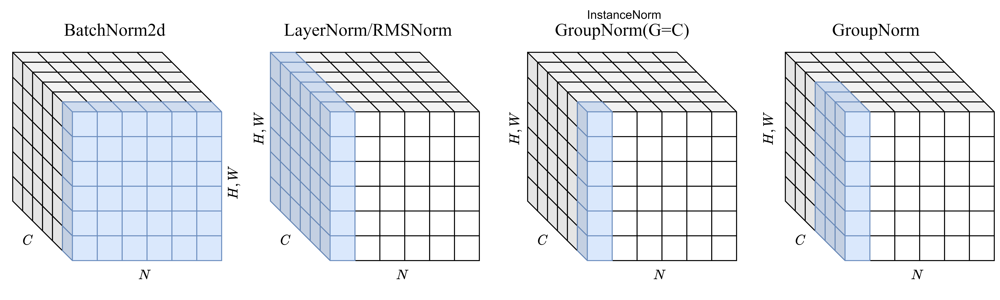

# Normalization Layers in PyTorch from Scratch

<div align="center">
    
    <p>Image Normalization Layers: BatchNorm2d, LayerNorm/RMSNorm, InstanceNorm(GroupNorm(G=C)), GroupNorm.</p>
    
    <p>NLP Normalization Layers: BatchNorm1d, LayerNorm/RMSNorm.</p>
</div>

This project implements various normalization layers in PyTorch, designed to offer the same functionality as PyTorch's built-in layers, including versions suitable for both image (typically 4D tensors `N, C, H, W`) and NLP tasks (typically 3D tensors `B, T, D`).

## Implemented Normalization Layers


| PyTorch Layer | Image | NLP | Custom Layer | Image | NLP |
|---------------|-------|-----|--------------|-------|-----|
| `BatchNorm2d` | ✅    | ❌  | [`BatchNorm2d`](normalize.py#L85) | ✅    | ❌  |
| `BatchNorm1d` | ❌    | ✅  | [`BatchNorm1d`](normalize.py#L66) | ❌    | ✅  |
| `GroupNorm`   | ✅    | ❌  | [`GroupNorm`](normalize.py#L101)   | ✅    | ❌  |
| `LayerNorm`   | ✅    | ✅  | [`LayerNorm`](normalize.py#L16)   | ✅    | ✅  |
| `RMSNorm`     | ✅    | ✅  | [`RMSNorm`](normalize.py#L34)     | ✅    | ✅  |


## Running Tests

The project includes unit tests to verify the implementations against PyTorch's native layers (where applicable).

To run the tests, execute the following command from the root directory:

```bash
python -m unittest discover -s tests -v
```

**Expected Test Output:**

```bash
test_batchnorm1d_nlp_example (tests.test_batchnorm1d.TestBatchNorm1d) ... ok
test_batchnorm2d_image_example (tests.test_batchnorm2d.TestBatchNorm2d) ... ok
test_groupnorm_image_example (tests.test_groupnorm.TestGroupNorm) ... ok
test_layernorm_image_example (tests.test_layernorm.TestLayerNorm) ... ok
test_layernorm_nlp_example (tests.test_layernorm.TestLayerNorm) ... ok
test_rmsnorm_image_example (tests.test_rmsnorm.TestRMSNorm) ... ok
test_rmsnorm_nlp_example (tests.test_rmsnorm.TestRMSNorm) ... ok

----------------------------------------------------------------------
Ran 7 tests in 0.739s

OK
```

> For details on unbiased variance estimation, which is relevant to normalization techniques, please refer to [docs/unbiased_variation_estimation.md](docs/unbiased_variation_estimation.md). However, we find that we always use the biased version `unbiased=False` to calculate the variance of the input tensor, as it is more stable and commonly used in practice.

## References

- [GroupNorm? Then BatchNorm, InstanceNorm, LayerNorm, …](https://medium.com/%40zljdanceholic/groupnorm-then-batchnorm-instancenorm-layernorm-e2b2a1d350a0)
- [Understanding Batch Normalization, Layer Normalization and Group Normalization by implementing from scratch](https://www.linkedin.com/pulse/understanding-batch-normalization-layer-group-implementing-pasha-s)
- [Lyken17/GroupNorm.pytorch](https://github.com/Lyken17/GroupNorm.pytorch/blob/master/group_norm.py)

## Citation

If you find this project useful, please consider citing it in your work:

```bibtex
@misc{normalization_layers_pytorch,
  author = {Dong, Linkang},
  title = {Normalization Layers in PyTorch from Scratch},
  year = {2025},
  publisher = {GitHub},
  journal = {GitHub repository},
  howpublished = {\url{https://github.com/donglinkang2021/normalize-layers-pytorch}}
}
```

## License

This project is licensed under the MIT License. See the [LICENSE](LICENSE) file for details.

